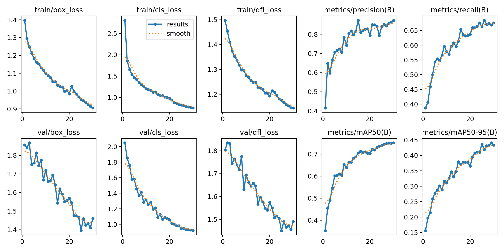
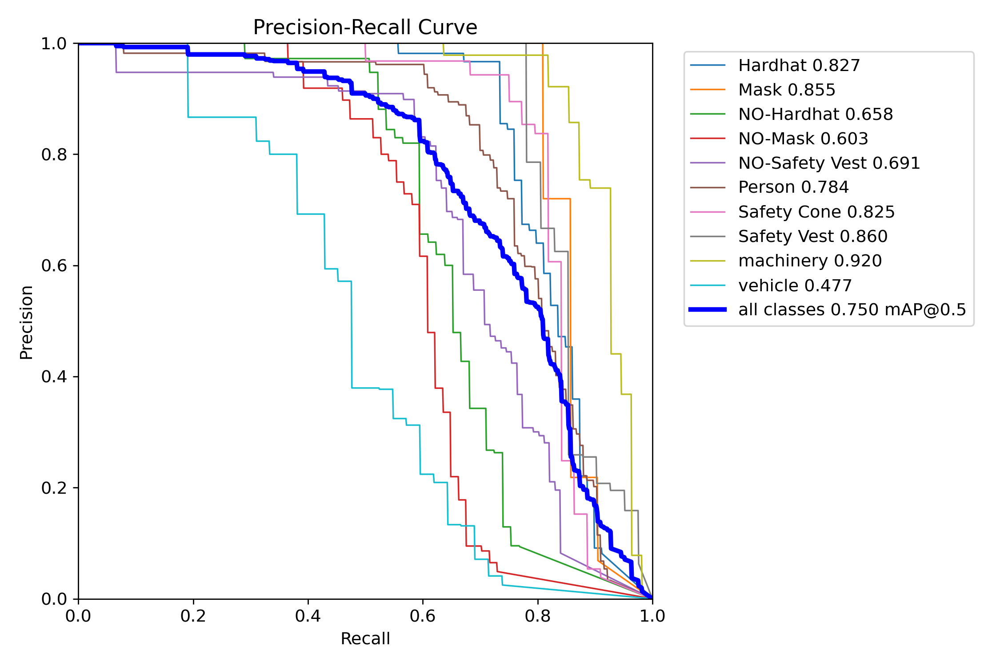
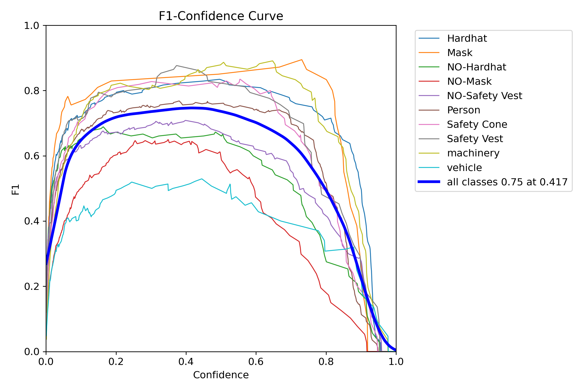
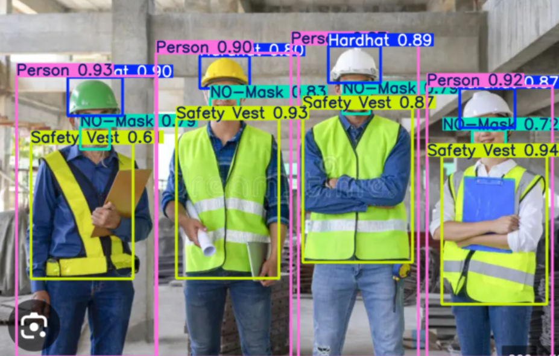

# 🦺 YOLOv8 PPE Detection – End-to-End AI System  
**Author: Hansung Cho**

본 프로젝트는 **건설 현장에서 PPE(안전 장비) 착용 여부를 자동 감지**하는  
YOLOv8 기반 End-to-End Computer Vision 시스템입니다.

Google Colab 모델 학습 → FastAPI 서버 → 웹 프론트엔드 UI →  
실시간 웹캠 감지까지 포함한 **Full Pipeline Project**입니다.

---

## 🚀 1. Project Overview

### ✔️ Custom YOLOv8 Model Training (Google Colab)
- PPE Dataset (Hardhat, Mask, Safety Vest, Person 등 **10 classes**)
- `custom_colab.yaml` 기반 데이터 구성
- YOLOv8n 모델 **fine-tuning**
- `best.pt` 모델 가중치 생성
- mAP50, mAP50-95, Precision, Recall 분석

### ✔️ Web-based PPE Detection (FastAPI)
- 업로드 이미지 → YOLO 모델 추론
- 감지된 결과 이미지를 **base64**로 반환
- Frontend에서 **요약 테이블 + 경고 UI** 표시

### ✔️ Real-time PPE Detection
- `webcam.html` → 브라우저 실시간 웹캠 감지
- `webcam_ppe.py` → 로컬 웹캠 감지
- 위험 클래스 감지 시 **알림(Warning UI)**

---

## 📁 2. Project Structure

---
```
YOLO_PPE/
├── backend/
│ ├── app.py # FastAPI backend server
│ └── model/
│ └── best.pt # Trained YOLOv8 PPE model
│
├── frontend/
│ ├── index.html # Image upload PPE detection UI
│ └── webcam.html # Real-time webcam detection UI
│
├── local/
│ └── webcam_ppe.py # Local Python webcam detection
│
├── training/
│ ├── custom_colab.yaml # Dataset yaml
│ ├── YOLO_PPE.ipynb # Full training / evaluation notebook
│ └── screenshots/
│  ├── results.png
│  ├── confusion_matrix.png
│  ├── BoxPR_curve.png
│  ├── BoxF1_curve.png
│  └── example.png
│
└── README.md
```
## 🧠 3. Model: Validation Performance

> Test 성능은 최종 제출용이므로 README에는 포함하지 않음.

| Metric        | Score  |
|---------------|--------|
| **mAP50**     | 0.750  |
| **mAP50-95**  | 0.441  |
| **Precision** | 0.866  |
| **Recall**    | 0.670  |

---

## 📊 4. Training & Evaluation Visualizations

### 📈 Training Curves  


### Confusion Matrix  


### PR Curve  


### F1 Curve  


### Prediction Example  


---

## 🌐 5. How to Run

### 5-1) Backend Server (FastAPI)

```bash
cd backend
pip install -r requirements.txt
uvicorn app:app --reload
```

### 5-2) Web Frontend 실행
- `frontend/index.html` → 이미지 업로드 감지
- `frontend/webcam.html` → 실시간 웹캠 감지  
브라우저에서 파일을 직접 열어도 실행됩니다.

### 5-3) Local Webcam Detection

```bash
python local/webcam_ppe.py
```

---

## ⭐ 6. Key Features
- YOLOv8 기반 PPE 전용 객체 탐지
- NO-Mask, NO-Hardhat 등 위험 요소 자동 경고
- 이미지 업로드/실시간 웹캠 감지 지원
- FastAPI + HTML/JS Web UI
- Custom dataset 기반 fine-tuning 경험
- End-to-End Full Pipeline 구현

---

## 📎 7. Model Download

You can access the model here:

👉 **[Hugging Face: YOLOv8 PPE Detection](https://huggingface.co/Hansung-Cho/yolov8-ppe-detection)**
---

## 🛠️ 8. Tech Stack
- YOLOv8 (Ultralytics)
- PyTorch
- Google Colab
- FastAPI / Uvicorn
- HTML / CSS / JavaScript
- OpenCV
- Git & GitHub

---

## 📘 9. Notebook (Training Log)
Colab 학습 로그는 아래 노트북에 기록되어 있습니다:

`training/YOLO_PPE.ipynb`

---

## 🎯 10. What I Learned
- YOLOv8 fine-tuning 전체 pipeline 이해
- Validation 성능 해석 (mAP/Precision/Recall)
- 실시간 웹 비전 시스템 구축
- Frontend–Backend–Model 연동 구조 이해
- base64 이미지 송수신 구조 구현

---

## 🐳 11. Docker Deployment

본 프로젝트는 FastAPI 기반 YOLOv8 PPE Detection 서버를  
**Docker로 컨테이너화하여 환경 충돌 없이 바로 실행**할 수 있도록 구성했습니다.  
Docker 이미지를 이용하면 어떤 환경에서도 동일한 설정으로 손쉽게 재현할 수 있습니다.

---

### 🚀 1) Pull the Docker Image

```bash
docker pull hansungcho/ppe-fastapi:latest
```
---

### 🚀 2) Run the Container

```bash
docker run -d -p 8000:8000 --name ppe-server hansungcho/ppe-fastapi
```

서버 실행 후 API는 아래에서 확인할 수 있습니다:

- Swagger UI → http://localhost:8000/docs
- Predict Endpoint → http://localhost:8000/predict

---

## 📦 12. Docker 기반 배포 지원

Docker를 이용해 AI 추론 서버를 컨테이너화함으로써 다음과 같은 이점을 얻었습니다:

- OS에 관계없이 동일한 환경
- 패키지 버전 충돌 및 의존성 문제 해결
- 빠른 재현성 확보
- 클라우드·온프레미스 환경 모두에서 배포 가능
- FastAPI + YOLOv8 환경을 그대로 독립 실행 가능

이번 프로젝트에서는 Dockerfile 구성부터 이미지 빌드, 배포 테스트까지 수행하여  
엔드투엔드 AI 시스템의 배포 가능한 형태를 완성했습니다.

---

## 🙌 13. Contact
문의: whgkstjd04@snu.ac.kr
